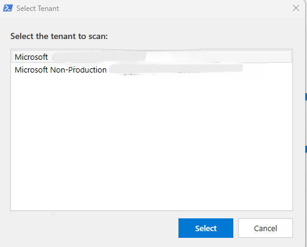
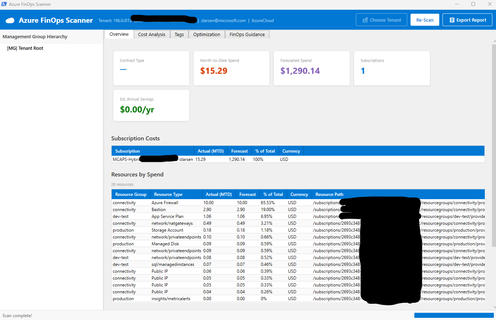
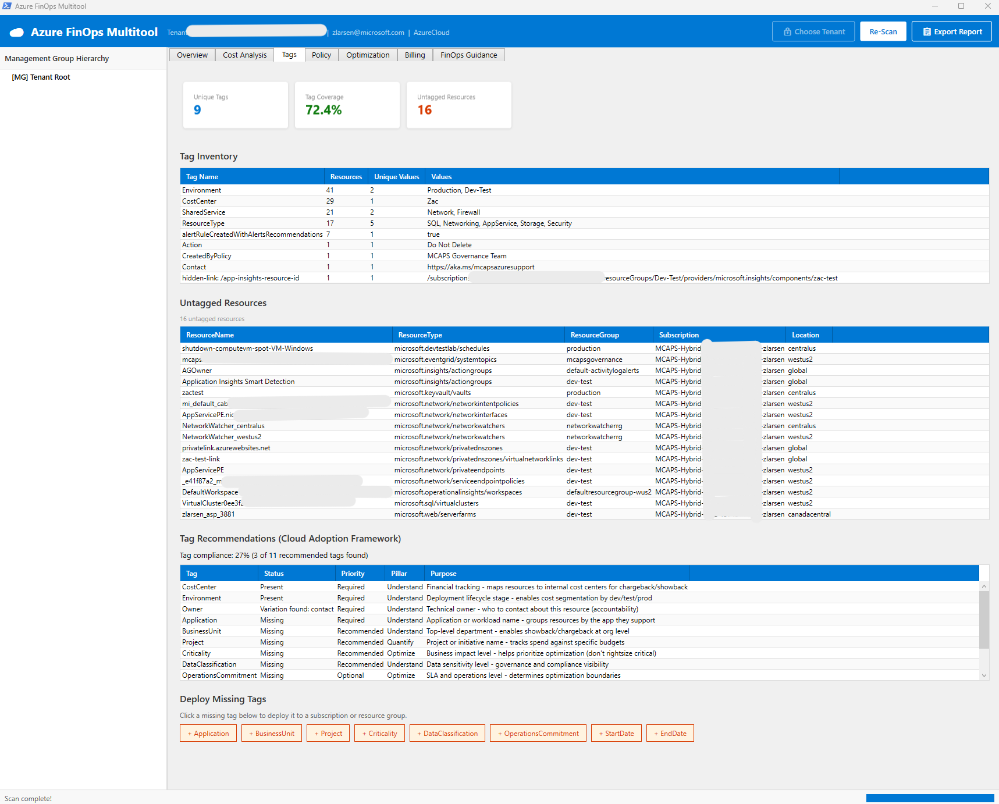
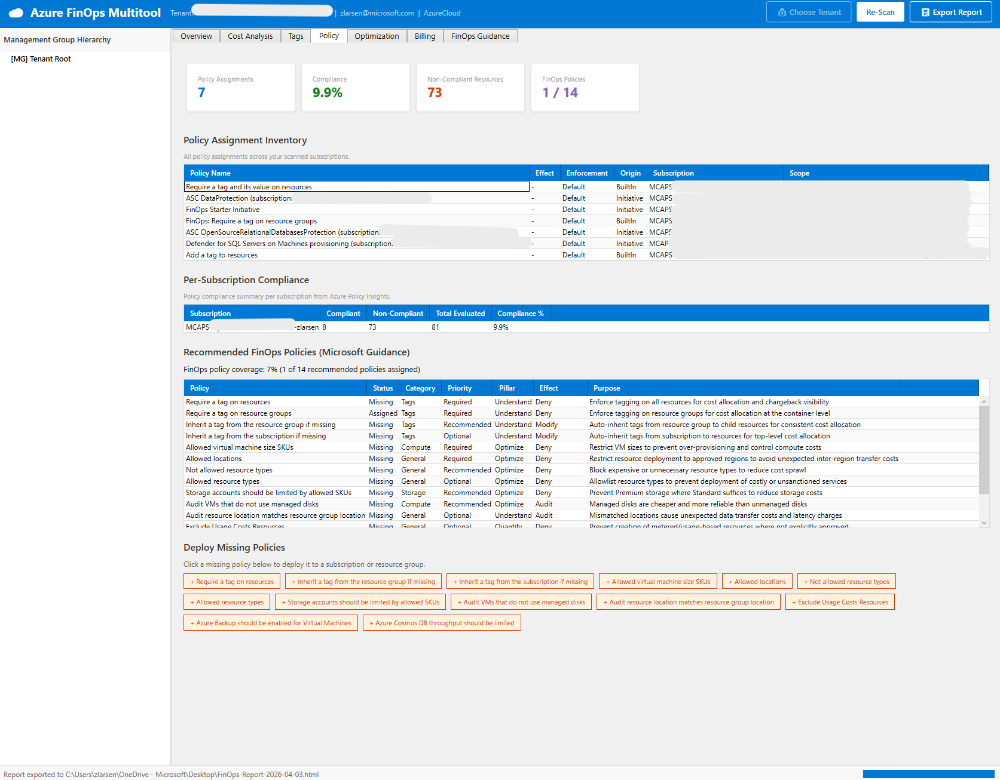
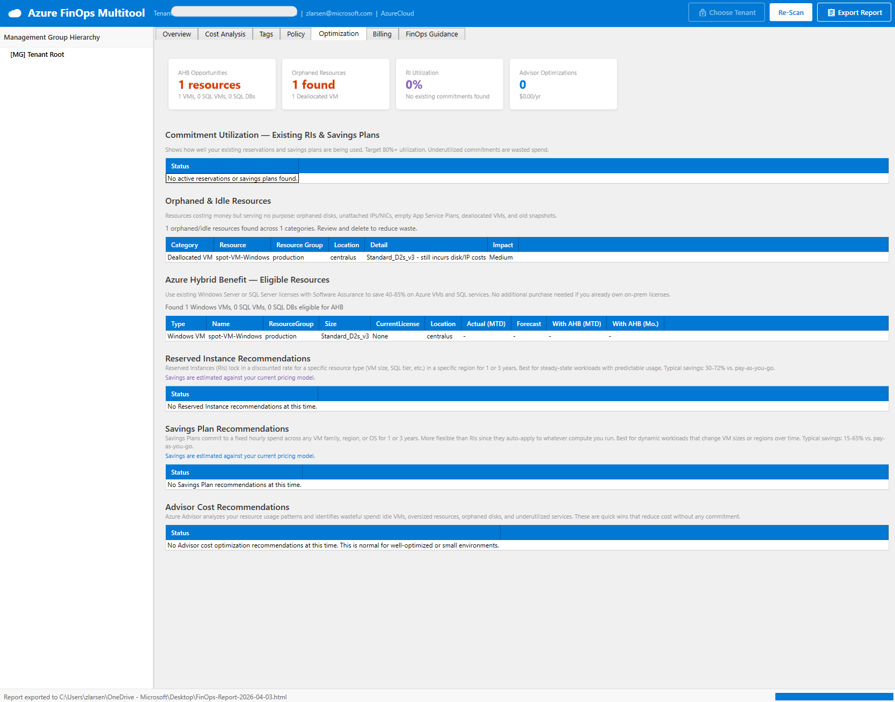
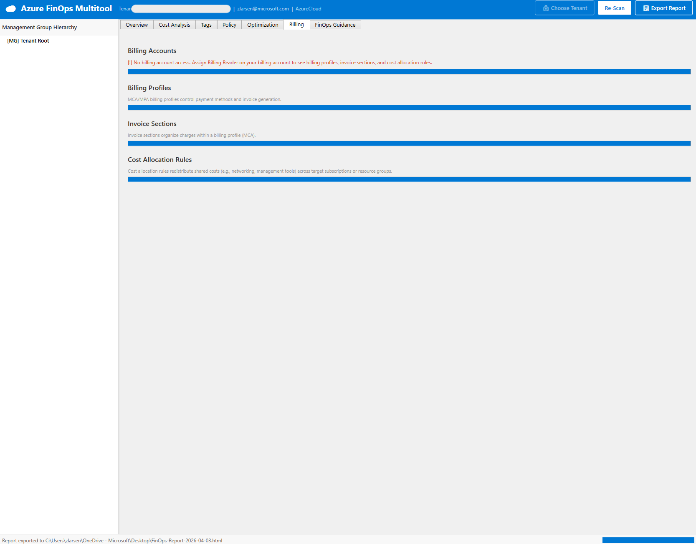
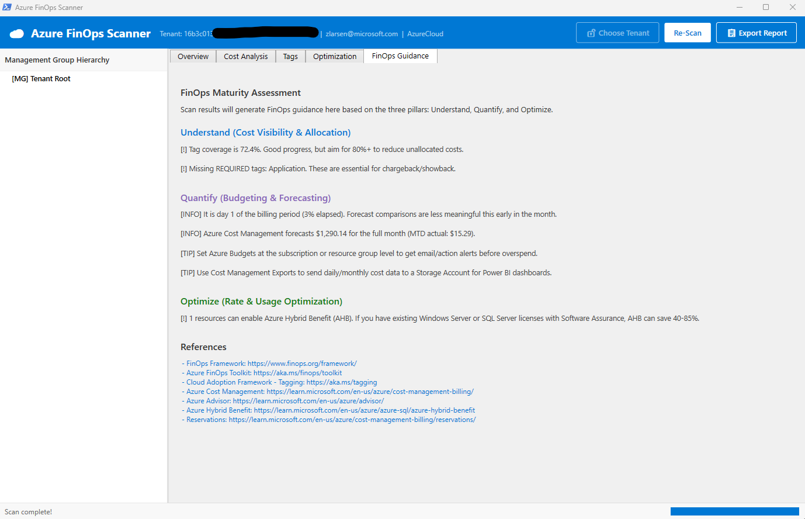

# AZURE FINOPS MULTITOOL

A PowerShell WPF application that scans an Azure tenant and provides a
single-pane-of-glass view of costs, tagging health, optimization
opportunities, and FinOps maturity — organized around the three FinOps
pillars: **Understand**, **Quantify**, and **Optimize**.

The FinOps Multitool is a lightweight, read‑only scanner designed to complement the Microsoft FinOps Toolkit. It does not replace Cost Management, FinOps Hubs, or Power BI starter kits. Instead, it helps practitioners quickly identify gaps, validate assumptions, and accelerate conversations during FinOps workshops and scoping engagements.
---

## Screenshots

### Choose Tenant — Multi-Tenant Picker


### Overview — Cost Summary, Budget Status & Subscription Scorecard


### Cost Analysis — 6-Month Trend, Anomalies & Cost by Tag


### Tags — Inventory & CAF Compliance


### Policy — Azure Policy Inventory, Compliance & FinOps Policy Deployment


### Optimization — Commitments, Orphaned Resources, AHB, RI/SP, Advisor


### Billing — Accounts, Profiles, Invoice Sections, Cost Allocation


### FinOps Guidance — Maturity Assessment


### Export Report


---

## Why This Exists

Most Azure customers know they have a FinOps problem. They don't know where to start.

The standard path — deploy FinOps Hubs, configure FOCUS exports, build Power BI reports — is powerful, but it assumes time, Power BI expertise, and organizational buy-in that most teams don't have on day one. The result: customers stall before they get their first win.

The Azure FinOps Multitool was built to solve the **cold start problem**. Run one script, get a complete picture of where your tenant stands: what things cost, what's untagged, what's orphaned, what policies are missing, and what your next three moves should be. No infrastructure to deploy. No dashboards to build. Just answers.

It's designed as the on-ramp — the tool that earns the first conversation, surfaces the first wins, and gives customers the foundation they need to grow into the full FinOps Toolkit and Cost Management capabilities Microsoft provides.

---

## What It Does

| Area                | Data Source                       | What You See                                              |
|---------------------|-----------------------------------|-----------------------------------------------------------|
| **Hierarchy**       | Management Groups API             | Full MG tree with subscriptions, costs inline              |
| **Costs**           | Cost Management API (MG scope)    | Actual month-to-date + forecast per subscription           |
| **Cost Trend**      | Cost Management API (6 months)    | Bar chart showing monthly spend over the last 6 months     |
| **Cost Anomalies**  | Cost Trend + per-sub cost data    | Subscriptions with 25%+ month-over-month cost changes      |
| **Resource Costs**  | Cost Management API (per sub)     | Per-resource spend with type, RG, forecast, % of total — filtered by dynamic spend threshold (0.1% of total) |
| **Contract**        | Billing Accounts API + ARM quotaId | EA, MCA, PAYGO, or CSP detection (quotaId fallback)        |
| **Tags**            | Azure Resource Graph              | Every tag name/value in use, untagged resource count        |
| **Cost by Tag**     | Cost Management API               | Spend broken down by CAF allocation tags (CostCenter, BusinessUnit, ApplicationName, etc.) plus auto-backfill of non-priority tags (up to 5 total); auto-fallback to last month |
| **Tag Deploy**      | ARM Tags API (PATCH merge)        | Click missing tags to deploy them to subscriptions or RGs  |
| **AHB**             | Azure Resource Graph              | Windows VMs, SQL VMs, and SQL DBs missing Hybrid Benefit   |
| **Commitments**     | Reservation Summaries + Benefit Utilization API | RI and Savings Plan utilization %, underutilized commitments |
| **Orphaned Resources** | Azure Resource Graph (6 KQL queries) | Orphaned disks, unattached IPs/NICs, deallocated VMs, empty ASPs, old snapshots — with per-resource Cost (MTD) and Est. Annual waste |
| **RI / SP**         | Advisor + Reservation Recs API    | RI and SP recs with Actual (MTD), Forecast, and savings    |
| **Advisor**         | Azure Advisor (Cost category)     | Rightsize, shutdown, delete, modernize recs with cost data |
| **Budget Status**   | Consumption Budgets API           | Budget vs actual per subscription, % used, risk level      |
| **Savings Realized** | Cost Management (ActualCost + AmortizedCost) | Monthly savings from existing RIs, Savings Plans, and AHB |
| **Scorecard**       | All of the above                  | Per-subscription health: cost, tags, optimizations, budget, trend |
| **Tag Recs**        | Cloud Adoption Framework baseline | Gap analysis against 7 CAF allocation tags (CostCenter, BusinessUnit, ApplicationName, WorkloadName, OpsTeam, Criticality, DataClassification) with deployment location |
| **Policy Inventory** | ARM Policy Assignment API + Resource Graph | All effective policy and initiative assignments including MG-inherited, with compliance state |
| **Policy Recs**     | CAF-aligned built-in policies & initiatives | Missing cost, tagging, security, and monitoring policies with deploy-from-GUI capability |
| **Policy Deploy**   | ARM Policy Assignment API (PUT)   | Deploy recommended policies with desired effect (Audit/Deny/etc.) |
| **Billing**         | Billing Accounts/Profiles API     | Billing accounts, profiles, invoice sections, EA depts     |
| **Cost Allocation** | Cost Management Allocation API    | Existing cost allocation rules with source/target counts   |
| **FinOps Guidance** | All of the above                  | FinOps Maturity Score (0-100) with weighted category breakdown and actionable advice |

---

## Prerequisites

1. **Windows** with PowerShell 5.1+ (WPF requires Windows)
2. **Az PowerShell modules** — install if missing:

   ```powershell
   Install-Module Az.Accounts, Az.Resources, Az.ResourceGraph, Az.CostManagement, Az.Advisor, Az.Billing -Scope CurrentUser
   ```

3. **Azure RBAC** — the signed-in account needs:

   **Scanning (read-only):**

   | Role                     | Scope             | Why                                  |
   |--------------------------|-------------------|--------------------------------------|
   | **Reader**               | Tenant root or MG | Read management groups + resources   |
   | **Cost Management Reader** | Tenant root or MG | Query cost and forecast data         |
   | **Billing Reader**       | Billing account   | Detect contract type (optional)      |

   **Deploying tags and policies (optional write actions):**

   | Role                     | Scope                  | Why                                  |
   |--------------------------|------------------------|--------------------------------------|
   | **Tag Contributor**      | Subscription or RG     | Deploy tags via ARM Tags API         |
   | **Resource Policy Contributor** | Subscription or MG | Deploy policy assignments (Audit/Deny) |
   | **Owner** (or Resource Policy Contributor + User Access Administrator) | Subscription or MG | Deploy policies with Modify or DeployIfNotExists effects (requires managed identity role assignment) |

   > If some roles are missing, the tool still works — it just skips
   > the data it can't access and shows warnings. Write permissions are
   > only needed if you click the deploy buttons on the Tags or Policy tabs.

4. **Azure Government** — fully supported. the tool auto-detects
   `AzureCloud` vs `AzureUSGovernment` from your existing session, or
   prompts you to choose if no session exists.

---

## Quick Start

```powershell
cd AzureFinOpsMultitool
.\Start-FinOpsMultitool.ps1
```

1. The WPF window opens (no authentication yet)
2. Click **Choose Tenant** — a browser login opens; after sign-in, a
   tenant picker dialog lists all accessible tenants
3. Select a tenant and click **Select**
4. Click **Scan Tenant** — the tool runs through 21 data-collection
   stages with a progress bar
5. When done, browse the tabs:
   - **Overview** — cost summary cards, savings realized, budget status, subscription cost table, top resources by spend, subscription scorecard
   - **Cost Analysis** -- 6-month cost trend bar chart, cost anomaly flags (25%+ MoM change), pick a tag from the dropdown to see spend by tag value
   - **Tags** -- tag inventory with unique values, coverage %, CAF compliance check, clickable missing tag buttons to deploy tags directly to subscriptions/RGs
   - **Policy** -- policy and initiative assignment inventory, compliance %, CAF-recommended policies and initiatives, clickable buttons to deploy policies with desired effect
   - **Optimization** -- commitment utilization (RI/SP %), orphaned/idle resources with cost data and estimated annual waste, AHB gaps, RI recs, SP recs, Advisor recs
   - **Billing** -- billing accounts, billing profiles (MCA), invoice sections, EA departments, cost allocation rules
   - **FinOps Guidance** — pillar-by-pillar assessment with selectable/copyable references

> The Choose Tenant button shows a lock icon: unlocked while choosing, locked once connected.
6. Click **Export Report** to save as CSV or HTML
7. Click **Choose Tenant** again any time to switch tenants without restarting

---

## Project Structure

```
AzureFinOpsMultitool/
├── Start-FinOpsMultitool.ps1              # Entry point — loads modules, launches GUI
├── modules/
│   ├── Initialize-Scanner.ps1           # Auth, tenant picker, environment detection (Commercial/Gov)
│   ├── Get-TenantHierarchy.ps1          # Management group tree
│   ├── Get-ContractInfo.ps1             # Billing account / contract type
│   ├── Get-CostData.ps1                 # Actual + forecast costs (MG scope → per-sub fallback)
│   ├── Get-CostTrend.ps1               # 6-month monthly cost trend data
│   ├── Get-ResourceCosts.ps1            # Per-resource cost breakdown with pagination
│   ├── Get-TagInventory.ps1             # Tag names, values, coverage
│   ├── Get-CostByTag.ps1               # Cost breakdown by tag (MG → per-sub fallback)
│   ├── Deploy-ResourceTag.ps1           # Deploy tags to subscriptions/RGs via ARM API
│   ├── Get-AHBOpportunities.ps1         # Azure Hybrid Benefit gaps
│   ├── Get-CommitmentUtilization.ps1    # RI & Savings Plan utilization data
│   ├── Get-OrphanedResources.ps1        # Orphaned disks, IPs, NICs, VMs, ASPs, snapshots
│   ├── Get-ReservationAdvice.ps1        # RI / SP recs (Resource Graph → REST fallback)
│   ├── Get-OptimizationAdvice.ps1       # Advisor cost optimizations (Resource Graph → REST fallback)
│   ├── Get-BudgetStatus.ps1             # Budget vs actual per subscription
│   ├── Get-SavingsRealized.ps1          # Savings from existing RIs, SPs, and AHB
│   ├── Get-TagRecommendations.ps1       # CAF tag compliance check
│   ├── Get-PolicyInventory.ps1          # Policy assignments + compliance (Resource Graph → per-sub fallback)
│   ├── Get-PolicyRecommendations.ps1    # 15 curated FinOps policies gap analysis
│   ├── Deploy-PolicyAssignment.ps1      # Deploy policy assignments via ARM REST API
│   └── Get-BillingStructure.ps1         # Billing accounts, profiles, invoice sections, cost allocation
├── gui/
│   └── MainWindow.xaml                  # WPF layout (Azure-themed, virtualized grids, trend chart)
└── README.md
```

Each module exports a single function and returns PSCustomObjects.
The main script dot-sources all modules and orchestrates the scan via
a `DispatcherTimer` so the UI updates between stages.

---

## How the Scan Works

| Stage | Module                    | API Used                                  | Time  |
|-------|---------------------------|-------------------------------------------|-------|
| 1     | Verify tenant context     | Uses auth from Choose Tenant step         | <1s   |
| 2     | Get-TenantHierarchy       | `Get-AzManagementGroup -Expand -Recurse`  | ~3s   |
| 3     | Get-ContractInfo          | REST: `/providers/Microsoft.Billing/...`  | ~1s   |
| 4     | Get-CostData              | REST: Cost Management Query (MG scope)    | ~5s   |
| 5     | Get-ResourceCosts         | REST: Cost Management Query (per sub)     | ~10s  |
| 6     | Get-TagInventory          | `Search-AzGraph` (cross-subscription)     | ~3s   |
| 7     | Get-CostByTag             | REST: Cost Management Query + tag group   | ~5s   |
| 8     | Get-CostTrend             | REST: Cost Management (Monthly, 6 months) | ~3s   |
| 9     | Get-AHBOpportunities      | `Search-AzGraph` (3 queries)              | ~3s   |
| 10    | Get-CommitmentUtilization  | REST: Reservation Summaries + Benefit Util API | ~5s |
| 11    | Get-OrphanedResources     | `Search-AzGraph` (6 KQL queries)          | ~3s   |
| 12    | Get-ReservationAdvice     | `Search-AzGraph` (advisorresources) + Reservation Recs API | ~3s |
| 13    | Get-OptimizationAdvice    | `Search-AzGraph` (advisorresources)       | ~3s   |
| 14    | Get-BudgetStatus          | REST: Consumption Budgets API (per sub)   | ~3s   |
| 15    | Get-SavingsRealized       | REST: Cost Management (ActualCost + AmortizedCost) + ARG; skipped if no commitments detected in stage 10 | ~5s |
| 16    | Get-TagRecommendations    | Local comparison + tag location map       | <1s   |
| 17    | Get-PolicyInventory       | ARM REST API (all effective) + Resource Graph compliance | ~3s |
| 18    | Get-PolicyRecommendations | Local comparison (no API call)            | <1s   |
| 19    | Get-BillingStructure      | REST: Billing Accounts/Profiles/Sections  | ~3s   |

> **Performance Note:** The tool is adaptive — it detects tenant size and
> optimizes accordingly. Cost queries try management-group scope first
> (one call for all subs). Policy inventory uses Resource Graph
> (`policyresources` table) for a single cross-tenant query. Advisor
> recommendations use `advisorresources` with automatic per-sub REST
> fallback. For large tenants (50+ subs) where MG-scope fails, the tool
> uses sample-first strategies: test 3 subs before iterating 300+, skip
> forecast queries, and short-circuit when data is absent. Budget queries
> sample 10 subs first — if no budgets exist, remaining subs are skipped.
> The UI stays responsive during long iterations via inline status updates.
> **Small tenant (1-10 subs): under 1 minute. Large tenant (300+ subs):
> 2-5 minutes with MG-scope, 5-10 minutes with per-sub fallback.**

---

## Key Design Decisions

| Decision | Why |
|----------|-----|
| MG-scope cost queries with per-sub fallback | One call covers all subs; auto-fallback if RBAC blocks MG scope |
| MonthToDate → TheLastMonth fallback | Cost-by-tag auto-retries with last month if current month has no data (early month) |
| Column-aware API parsing | Reads column headers from Cost Management responses instead of hardcoded indices |
| ARM ResourceId cost lookup | Constructs full ARM resource path for cost matching in optimization grids |
| Lock icon on Choose Tenant | Visual feedback — unlocked while picking, locked once connected |
| Resource Graph for Advisor | Single cross-tenant query via `advisorresources` table; REST fallback if ARG unavailable |
| Resource Graph for tags + AHB | Cross-subscription, fast (KQL), paginated |
| API pagination (nextLink) | Cost Management caps results at ~5000 rows; pagination captures all resources |
| List\<T\> instead of array += | O(n) vs O(n^2) — critical for tenants with 1000s of resources |
| DataGrid virtualization | WPF only renders visible rows; prevents UI freeze on large datasets |
| Dynamic resource spend threshold | Resource grid includes all resources above 0.1% of total actual spend (min $1); avoids arbitrary caps while filtering noise |
| DispatcherTimer staged loading | UI stays responsive between data-collection stages |
| Modular .ps1 files | Each module testable independently; clean path to C# conversion |
| CAF tag baseline | Comparison against Microsoft's own recommended tags, not arbitrary |
| Fallback on every module | If an API fails (RBAC, throttling), the scan continues gracefully |
| UTF-8 BOM on all .ps1 files | Ensures PS 5.1 reads special characters correctly |
| 100% ASCII XAML | All non-ASCII replaced with XML entities to avoid WPF encoding issues |
| Auto-detect Azure environment | Supports both Commercial and Azure Government without config changes |
| Separate Choose Tenant / Scan buttons | Auth happens once via Choose Tenant; scan is repeatable without re-auth |
| WPF minimize during browser auth | MSAL browser login needs the foreground; scanner minimizes then restores |
| Tenant picker dialog | WPF ListBox shows all accessible tenants; supports 30+ tenants cleanly |
| LoginExperienceV2 suppressed | `$env:AZURE_LOGIN_EXPERIENCE_V2=Off` prevents Az.Accounts 12+ console subscription picker |
| Contract type quotaId fallback | Infers EA/MCA/PAYGO/Internal from ARM subscription quotaId when Billing API is inaccessible |
| 4-column optimization grids | Each recommendation shows Actual (MTD), Forecast, With-X savings, and Annual Savings |
| Pure WPF bar chart | Cost trend drawn with Canvas + Rectangles — no NuGet charting libraries needed |
| Tag deployment via ARM Tags API | PATCH merge preserves existing tags; only adds/updates the target tag |
| Policy deployment via ARM PUT | Deploy recommended FinOps policies with user-selected effect (Audit/Deny/etc.) |
| Lazy scope loading for tag deploy | Subscription/RG list fetched on first tag deploy click, cached for session |
| Background runspace for tag deploy | Tag deployment runs in a background runspace with 30s timeout; UI stays responsive via DispatcherFrame polling |
| MG-scope fail-once flag | First cost module that gets 401/403 at MG scope sets a shared flag; all subsequent modules skip to per-sub instantly instead of retrying |
| 429 throttle retry | `Invoke-AzRestMethodWithRetry` wraps all REST calls with automatic retry on HTTP 429, exponential backoff, and DispatcherFrame UI-responsive wait |
| Resource Graph safe wrapper | `Search-AzGraphSafe` runs all Resource Graph calls in background runspaces with 60s timeout, 429 retry, and JSON round-trip to preserve nested properties |
| Tag compliance location column | Tag recommendations grid shows where each present tag is deployed (Subscription / Resource Group) |
| MG-inherited policy discovery | ARM REST API `GET policyAssignments` returns all effective policies including those inherited from management groups and tenant root |
| Billing structure discovery | Queries billing accounts, profiles, invoice sections, EA departments, and cost allocation rules |
| Commitment utilization tracking | Queries Reservation Summaries + Benefit Utilization APIs to show RI/SP usage % |
| Orphaned resource detection | 6 Resource Graph KQL queries find waste: orphaned disks, unattached IPs/NICs, deallocated VMs, empty ASPs, old snapshots |
| Budget vs actual monitoring | Per-subscription budget query with risk levels: Over Budget, At Risk, Watch, On Track |
| Savings realized calculation | Compares ActualCost vs AmortizedCost by charge type to quantify RI/SP/AHB savings |
| Orphaned resource cost enrichment | Each orphan shows Cost (MTD) and Est. Annual waste from the shared resource cost map; summary totals estimated waste across all costed resources |
| Shared resource cost map | `Build-ResourceCostMap` builds a single ARM-path-keyed lookup shared by Optimization and Orphan sections — avoids duplicate work |
| CAF-aligned policy recommendations | Policy recs expanded to include Azure Security Benchmark v3, Secure Transfer, Diagnostic Settings, and Allowed Locations; distinguishes Policy vs Initiative assignments |
| Non-priority tag backfill | Cost-by-tag queries the priority list first, then backfills discovered tags up to 5 total (skipping system prefixes like `hidden-`, `aks-managed-`) |
| CAF allocation tag alignment | Tag recommendations, cost-by-tag, and maturity scoring all use the same 7 CAF tags: CostCenter, BusinessUnit, ApplicationName, WorkloadName, OpsTeam, Criticality, DataClassification |
| Weighted tag scoring | Allocation score uses per-tag weights: CostCenter and BusinessUnit = 3 pts each, ApplicationName = 2 pts, remaining 4 tags = 1 pt each (12 pts total from tags out of 20) |
| Commitment-aware savings skip | Stage 15 (SavingsRealized) checks commitment data from stage 10; if no RIs or Savings Plans exist, all Cost Management savings queries are skipped (saves 2-120 API calls) |
| Cost anomaly flagging | Per-subscription MoM delta computation; flags 25%+ changes for investigation |
| Subscription scorecard | Composite per-sub view combining cost, tags, optimizations, orphans, budget, trend |
| Adaptive large-tenant scanning | Sample-first, cross-tag short-circuit, budget sampling, forecast skip for 50+ subs |
| Resource Graph for policy inventory | `policyresources` table replaces per-sub REST; MG-scope compliance in 1 call |

---

## Customization

- **Add a tag to recommendations**: Edit `Get-TagRecommendations.ps1` → `$recommendedTags` array (update `Get-CostByTag.ps1` `$targetTags` and the Allocation scoring in `Start-FinOpsMultitool.ps1` to match)
- **Change theme colors**: Edit `gui/MainWindow.xaml` → `Window.Resources` brushes
- **Add a new data module**: Create `modules/Get-YourData.ps1`, dot-source in `Start-FinOpsMultitool.ps1`, add a scan stage

---

## Scalability

Tested with tenants from 1 subscription to 300+. Key scalability features:

- **Adaptive tenant-size detection** — Classifies tenants as Small (1-10),
  Medium (11-50), or Large (51+) and adjusts scan strategy accordingly
- **API pagination** — Cost Management `nextLink` followed automatically so
  tenants with 5000+ billed resources get complete data
- **O(n) collection building** — Uses `List<PSCustomObject>` instead of
  `$array +=` to avoid quadratic memory allocation
- **Dynamic resource spend threshold** — Overview grid shows all resources
  above 0.1% of total actual spend (minimum $1) to filter noise while
  ensuring all meaningful resources are visible; a note shows the threshold
- **DataGrid virtualization** — Row and column virtualization with recycling
  enabled so WPF only renders visible rows
- **MG-scope-first queries** — Cost and tag queries try a single MG-scope
  call before falling back to per-subscription loops. A shared fail-once flag
  ensures only one module probes MG-scope — if it returns 401/403, all
  subsequent modules skip to per-sub instantly
- **Throttle-resilient REST calls** — `Invoke-AzRestMethodWithRetry` wraps
  all Cost Management and ARM REST calls with automatic 429 retry, exponential
  backoff (10-60s), and DispatcherFrame-based UI-responsive waiting
- **Resource Graph safe wrapper** — `Search-AzGraphSafe` runs all Resource
  Graph queries in background runspaces with 60-second timeout and 429 retry.
  JSON serialization inside the runspace preserves nested property hierarchy
  across the process boundary
- **Resource Graph everywhere** — Policy inventory, Advisor, RI/SP, tags,
  AHB, and orphaned resources all use Resource Graph for single cross-tenant
  calls instead of per-sub REST loops
- **Sample-first fallback** — When per-sub iteration is required, the tool
  tests 3 subs first; if all return empty, remaining subs are skipped
- **Cross-tag short-circuit** — If cost-by-tag returns nothing for the first
  tag, remaining tags are skipped entirely
- **Budget sampling** — For 50+ subs, samples 10 subs first; skips remaining
  if no budgets are configured
- **Forecast skip for large tenants** — Per-sub forecast API calls (which
  double the call count) are skipped for 50+ subs; uses CostData ratios instead
- **Inline UI status updates** — Modules call `Update-ScanStatus` during long
  loops so the UI shows progress ("Querying costs 25/307...") instead of freezing
- **MG hierarchy uses pre-loaded subs** — Fallback doesn't re-fetch
  subscriptions, using the list already retrieved during auth

| Tenant Size | Subs | MG-Scope OK | MG-Scope Fails |
|-------------|------|-------------|----------------|
| Small       | 1-10 | < 1 min     | < 1 min        |
| Medium      | 11-50 | < 1 min    | 1-3 min        |
| Large       | 51-300+ | 2-3 min  | 5-10 min       |

---

## Roadmap

The current tool covers FinOps discovery and remediation — the first two capabilities in a larger vision.

The longer-term direction is an **agentic FinOps layer**: a set of autonomous agents that don't just surface findings but act on them continuously. Discovery, anomaly detection, remediation, optimization recommendations, and reporting — orchestrated as a team rather than a one-time scan.

The Azure FinOps Multitool is the foundation that makes that possible: a proven, field-tested data layer with direct write-back to Azure. The agent orchestration layer comes next.

### Near-term

- [ ] Custom tag deployment (user-defined tags, not just CAF recommendations)
- [ ] PDF export with charts
- [ ] Scheduled/headless scan mode with email report delivery

### Longer-term

- [ ] C# / WPF conversion (full async, MVVM architecture)
- [ ] Agentic orchestration layer (anomaly agent, optimization agent, reporting agent)
- [ ] Power BI integration — auto-generate a starter report from scan data

### Completed

- [x] ~~Budget vs. actual comparison per subscription~~ — Budget Status module with risk levels
- [x] ~~Cost trend chart (last 6 months)~~ — WPF Canvas bar chart with per-subscription filter
- [x] ~~Anomaly detection (spike alerts)~~ — 25%+ MoM cost change flagging per subscription
- [x] ~~Azure Policy compliance overlay~~ — Policy tab with inventory, compliance %, CAF policy and initiative recs, deploy from GUI
- [x] ~~Orphaned resource cost data~~ — Per-resource Cost (MTD) and Est. Annual waste columns with total waste summary
- [x] ~~CAF policy alignment~~ — Policy recommendations expanded to CAF-aligned policies and initiatives (Security Benchmark v3, Secure Transfer, Diagnostic Settings, Allowed Locations)
- [x] ~~Non-priority tag backfill~~ — Cost-by-tag auto-discovers additional tags beyond the priority list (up to 5 total)
- [x] ~~CAF allocation tag alignment~~ — Tag list, cost-by-tag, and scoring all aligned to 7 CAF allocation tags with weighted maturity scoring
- [x] ~~Commitment-aware savings skip~~ — SavingsRealized skips Cost Management queries when no RIs/SPs exist (stage 10 data reuse)

---

## FinOps Maturity Score

The Guidance tab calculates a 0-100 maturity score based on the FinOps Foundation Maturity Model and Microsoft Cloud Adoption Framework. The score is broken into five categories:

### Visibility -- 25 pts

| Points | Criteria |
|--------|----------|
| 0-10 | Tag coverage (% of resources tagged, scaled) |
| 5 | Cost data retrieved from Cost Management API |
| 5 | 6-month cost trend data available |
| 5 | Resource-level cost breakdown available |

### Allocation -- 20 pts

Uses per-tag weights so the tags that matter most for chargeback/showback carry more points:

| Points | Criteria |
|--------|----------|
| 3 | CostCenter tag present |
| 3 | BusinessUnit tag present |
| 2 | ApplicationName tag present |
| 1 | WorkloadName tag present |
| 1 | OpsTeam tag present |
| 1 | Criticality tag present |
| 1 | DataClassification tag present |
| 4 | Cost-by-tag data returns results |
| 4 | Azure Cost Allocation Rules configured |

Tag variations are recognized (e.g., `cost-center`, `cc`, `bu`, `dept`, `application`).

### Budgeting -- 15 pts

| Points | Criteria |
|--------|----------|
| 5 | At least one budget exists |
| 0-5 | Budget coverage across subscriptions (% scaled) |
| 5 | No subscriptions over budget (3 if some at-risk but none over) |

### Optimization -- 20 pts

| Points | Criteria |
|--------|----------|
| 5 | RI/SP utilization >= 80% (3 if >= 60%, 2 if no commitments) |
| 5 | Savings realized from existing commitments |
| 0-5 | Low Advisor recommendation count (5 if zero, 3 if <= 3, 1 if <= 10) |
| 0-5 | Low orphaned resource count (5 if zero, 3 if <= 3, 1 if <= 10) |

### Governance -- 20 pts

| Points | Criteria |
|--------|----------|
| 5 | Has Azure Policy assignments |
| 0-5 | FinOps-recommended policies assigned (% scaled) |
| 5 | Policy compliance >= 80% (3 if >= 50%) |
| 5 | Management group hierarchy exists (2 if flat subs only) |

### Grade Scale

| Score | Grade |
|-------|-------|
| 85-100 | Excellent |
| 70-84 | Good |
| 50-69 | Developing |
| 30-49 | Foundational |
| 0-29 | Getting Started |

---

## Author

Built by **Zac Larsen**, Cloud Solution Architect @ Microsoft.

Developed from real-world FinOps customer engagements to solve the gap between "we know we need FinOps" and "we have actionable visibility today." Designed as a complement to the Azure FinOps Toolkit, not a replacement for it.

Questions, feedback, and contributions welcome.

---

## References

- [FinOps Framework](https://www.finops.org/framework/)
- [Azure FinOps Toolkit](https://aka.ms/finops/toolkit)
- [Cloud Adoption Framework — Tagging](https://aka.ms/tagging)
- [Azure Cost Management](https://learn.microsoft.com/en-us/azure/cost-management-billing/)
- [Azure Advisor](https://learn.microsoft.com/en-us/azure/advisor/)
- [Azure Hybrid Benefit](https://learn.microsoft.com/en-us/azure/azure-sql/azure-hybrid-benefit)
- [Reservation Recommendations](https://learn.microsoft.com/en-us/azure/cost-management-billing/reservations/)
